# IME Maintenance Dashboard — Software Architecture Documentation

> **Last updated:** July 2026  
> **Stack:** React 18 + TypeScript · Vite · Supabase (Postgres + Auth + Storage + Edge Functions) · Tailwind CSS · Recharts · Web Audio API  
> **Ingest:** PowerShell live sync from on-prem UAS3 PostgreSQL (`scripts/sync-uas3.ps1`)  
> **Deployed:** Vercel (frontend) · Supabase Cloud — us-east-1 (backend)

---

## Table of Contents

1. [System Overview](#1-system-overview)
2. [Technology Stack](#2-technology-stack)
3. [Frontend Application Structure](#3-frontend-application-structure)
4. [Context & State Management](#4-context--state-management)
5. [Routing & Access Control](#5-routing--access-control)
6. [Database Schema (ERD)](#6-database-schema-erd)
7. [Data Hierarchy](#7-data-hierarchy)
8. [Authentication & Authorization](#8-authentication--authorization)
9. [Row-Level Security (RLS) Model](#9-row-level-security-rls-model)
10. [Frontend ↔ Supabase Communication](#10-frontend--supabase-communication)
11. [UAS3 Live Sync (PowerShell)](#11-uas3-live-sync-powershell)
12. [Ultrasound Signal Pipeline (Waveform · FFT · Audio)](#12-ultrasound-signal-pipeline-waveform--fft--audio)
13. [Findings & Work Orders](#13-findings--work-orders)
14. [Feedback System](#14-feedback-system)
15. [Page & Component Inventory](#15-page--component-inventory)
16. [Scope System (Multi-Tenant Filtering)](#16-scope-system-multi-tenant-filtering)
17. [Asset Lifecycle Model](#17-asset-lifecycle-model)
18. [Deployment Architecture](#18-deployment-architecture)

---

## 1. System Overview

The IME Maintenance Dashboard is a **multi-tenant predictive maintenance platform** for manufacturing facilities. It ingests ultrasound measurement data — readings *and* raw acoustic signals — directly from on-prem UAS3 (Ultrasound Analysis Suite 3) databases, visualizes equipment health across a plant hierarchy, auto-derives findings and work orders, and tracks asset lifecycle events.

```
┌──────────────────────────────────────────────────────────────────────────┐
│                              IME Platform                                  │
│                                                                            │
│   ┌──────────────────┐         ┌────────────────────────────────────┐     │
│   │  React Frontend  │  HTTPS  │            Supabase Cloud          │     │
│   │  (Vercel CDN)    │◄───────►│  ┌──────────┐ ┌──────────┐         │     │
│   │                  │  REST   │  │ PostgREST│ │   Auth   │         │     │
│   │  - Dashboard     │  +JWT   │  │   API    │ │  (JWT)   │         │     │
│   │  - Assets        │         │  └────┬─────┘ └──────────┘         │     │
│   │  - Ultrasound    │         │       │        ┌───────────────┐   │     │
│   │  - Findings/WOs  │         │  ┌────▼──────┐ │ Edge Functions│   │     │
│   │  - Admin         │         │  │ PostgreSQL│ │ (Deno / SMTP) │   │     │
│   │  Web Audio decode│         │  │  17 + RLS │ └───────────────┘   │     │
│   └──────────────────┘         │  └───────────┘ ┌───────────────┐   │     │
│                                │                │    Storage    │   │     │
│                                │                │ images ·      │   │     │
│                                │                │ uas-signals · │   │     │
│                                │                │ feedback      │   │     │
│                                │                └───────────────┘   │     │
│                                └───────────▲────────────────────────┘     │
│                                            │ HTTPS (PostgREST + Storage)   │
│   ┌───────────────────────────────────────┴───────────┐                   │
│   │  On-prem UAS3 machine                              │                   │
│   │  ┌─────────────────┐   psql   ┌────────────────┐   │                   │
│   │  │ UAS3 PostgreSQL │◄────────►│ sync-uas3.ps1  │   │  service key      │
│   │  │ (localhost:5423)│          │ (PowerShell)   │───┼──► upsert +       │
│   │  └─────────────────┘          └────────────────┘   │    signal upload  │
│   └────────────────────────────────────────────────────┘                   │
└──────────────────────────────────────────────────────────────────────────┘

Legacy: an in-browser Excel (.xlsx) importer still exists in code but its UI
buttons are disabled — the PowerShell live sync replaced it.
```

---

## 2. Technology Stack

| Layer | Technology | Purpose |
|-------|-----------|---------|
| Frontend framework | React 18 + TypeScript 5 | UI rendering, type safety |
| Build tool | Vite | Dev server (port 4000), production bundling |
| Styling | Tailwind CSS | Utility-first CSS |
| Routing | React Router v6 | Client-side SPA routing |
| Charts | Recharts | PieChart (donut), LineChart (trends), FFT spectrum + waveform |
| Signal decode | Web Audio API (`decodeAudioData`) + `Float32Array` | Decode FLAC waveforms + FFT blobs in-browser |
| Data ingest | **PowerShell** (`sync-uas3.ps1`) | Live sync from on-prem UAS3 Postgres → Supabase |
| Excel parsing (legacy) | SheetJS (xlsx) | Old `.xlsx` importer — code retained, UI disabled |
| Internationalization | react-i18next | English / Spanish toggle |
| Icons | lucide-react | UI icons |
| Screenshot capture | html2canvas | Feedback widget viewport capture |
| Backend | Supabase (PostgreSQL 17) | Database, auth, storage, RLS |
| API | PostgREST (via Supabase) | Auto-generated REST API from schema |
| Serverless | Supabase Edge Functions (Deno) | `submit-feedback` (Gmail SMTP via denomailer) |
| Auth | Supabase Auth (JWT) | Email/password, magic link invite flow |
| File storage | Supabase Storage | Equipment images · `uas-signals` · `feedback-screenshots` |
| Hosting | Vercel | Frontend CDN + edge |

---

## 3. Frontend Application Structure

```
src/
├── main.tsx                    # Entry point — mounts <App />
├── App.tsx                     # Provider tree + router
├── index.css                   # Global Tailwind styles
│
├── lib/
│   └── supabase.ts             # Supabase client (URL + anon key)
│
├── types/
│   └── auth.ts                 # Profile, UserRole types
│
├── context/
│   ├── AuthContext.tsx          # Session, profile, signIn/signOut
│   ├── ScopeContext.tsx         # Company/location/line selection
│   └── AssetContext.tsx         # Asset panel state
│
├── layouts/
│   └── AppLayout.tsx            # Header + Sidebar + <Outlet>
│
├── components/
│   ├── Header.tsx               # Top bar: scope selectors, user menu
│   ├── Sidebar.tsx              # Left nav (desktop)
│   ├── MobileNav.tsx            # Bottom tab bar (mobile)
│   ├── RequireAuth.tsx          # Route guard: redirects to /login
│   ├── RequireRole.tsx          # Route guard: role-based access
│   └── EquipmentDetail.tsx      # Equipment modal (tabs, lifecycle)
│
├── pages/
│   ├── Login.tsx                # Email/password sign-in
│   ├── SetPassword.tsx          # Invite link → set password
│   ├── Dashboard.tsx            # KPIs, alarm panels, route compliance
│   ├── Assets.tsx               # Asset tree + EquipmentDetail modal
│   ├── Ultrasound.tsx           # UAS measurements, trend charts, import
│   ├── WorkOrders.tsx           # (stub)
│   ├── Inspections.tsx          # (stub)
│   ├── PMCalendar.tsx           # (stub)
│   ├── Reports.tsx              # (stub)
│   ├── Admin.tsx                # IME Admin: user + company management
│   ├── Settings.tsx             # (stub)
│   └── Vibration.tsx            # (stub)
│
├── utils/
│   ├── uasImporter.ts           # Excel → Supabase upsert pipeline
│   └── excelParser.ts           # Generic Excel utilities
│
├── data/
│   └── mockData.ts              # AssetNode type definition
│
└── i18n/
    ├── index.ts                 # i18next config
    ├── en.ts                    # English strings
    └── es.ts                    # Spanish strings
```

---

## 4. Context & State Management

Three React context providers are nested at the application root. They load in dependency order: Auth → Scope → Asset.

```
┌─────────────────────────────────────────────────────────────┐
│  <AuthProvider>                                             │
│  Manages: session, user, profile, loading                   │
│  Source: supabase.auth                                      │
│                                                             │
│  ┌───────────────────────────────────────────────────────┐  │
│  │  <ScopeProvider>                                      │  │
│  │  Manages: companies[], locations[], lines[]           │  │
│  │           selectedCompanyId, selectedLocationId,      │  │
│  │           selectedLineId                              │  │
│  │  Source: DB tables companies, locations, lines        │  │
│  │  Cascades: company change → reset location + lines    │  │
│  │            location change → reset selectedLineId     │  │
│  │                                                       │  │
│  │  ┌─────────────────────────────────────────────────┐  │  │
│  │  │  <AssetProvider>                                │  │  │
│  │  │  Manages: selected asset panel state            │  │  │
│  │  │                                                 │  │  │
│  │  │  <BrowserRouter>                                │  │  │
│  │  │    All page components                          │  │  │
│  │  │  </BrowserRouter>                               │  │  │
│  │  └─────────────────────────────────────────────────┘  │  │
│  └───────────────────────────────────────────────────────┘  │
└─────────────────────────────────────────────────────────────┘
```

### ScopeContext Load Cascade

```
Profile loads
     │
     ▼
ime_admin? ──YES──► fetch ALL companies
     │               └─► setCompanies([...])
     NO
     │
     ▼
fetch profile.company_id ──► setCompanies([own])
                              setSelectedCompanyId(own)
                                    │
                                    ▼
                         selectedCompanyId changes
                                    │
                                    ▼
                         fetch locations for company
                                    │
                          plant_manager? ──YES──► lock to profile.location_id
                                    │
                                    ▼
                         selectedLocationId changes
                                    │
                                    ▼
                    fetch lines for location ──► setLines([...])
                    reset selectedLineId = null
```

---

## 5. Routing & Access Control

```
/login              → <Login>          (public)
/set-password       → <SetPassword>    (public, invite link)
│
└─ <RequireAuth>    (redirects to /login if no session)
   └─ <AppLayout>   (Header + Sidebar + Outlet)
      │
      ├── /                → <Dashboard>      (all authenticated roles)
      ├── /assets          → <Assets>         (all authenticated roles)
      ├── /ultrasound      → <Ultrasound>     (all authenticated roles)
      ├── /work-orders     → <WorkOrders>     (all authenticated roles)
      ├── /inspections     → <Inspections>    (all authenticated roles)
      ├── /pm-calendar     → <PMCalendar>     (all authenticated roles)
      ├── /reports         → <Reports>        (all authenticated roles)
      ├── /settings        → <Settings>       (all authenticated roles)
      │
      └─ <RequireRole roles={['ime_admin']}>
         └── /admin        → <Admin>          (ime_admin ONLY)
```

---

## 6. Database Schema (ERD)

```mermaid
erDiagram
    companies {
        uuid id PK
        text name
        text industry
        text country
        text status
        timestamptz created_at
    }

    locations {
        uuid id PK
        uuid company_id FK
        text name
        date next_visit_date
        timestamptz created_at
    }

    lines {
        uuid id PK
        uuid location_id FK
        uuid company_id FK
        text name
        uuid uas_uid UK "UAS3 node uid — upsert key"
        timestamptz synced_at "mark-and-sweep stamp"
        timestamptz created_at
    }

    sections {
        uuid id PK
        uuid line_id FK
        uuid company_id FK
        text uas_name
        text survey_name
        uuid uas_uid UK
        timestamptz synced_at
        timestamptz created_at
    }

    equipment {
        uuid id PK
        uuid section_id FK
        uuid company_id FK
        text tag
        text status
        text status_note
        timestamptz last_replaced_at
        text image_url
        text display_name
        text asset_type
        text manufacturer
        text model
        text serial_number
        date installation_date
        text location_notes
        text spec_rated_power
        text spec_rated_speed
        text spec_flow_rate
        text spec_pressure
        text spec_temperature
        text spec_weight
        uuid uas_uid UK
        timestamptz synced_at
        timestamptz created_at
    }

    components {
        uuid id PK
        uuid equipment_id FK
        uuid company_id FK
        text name
        uuid uas_uid UK
        timestamptz synced_at
        timestamptz created_at
    }

    measurement_points {
        uuid id PK
        uuid component_id FK
        uuid company_id FK
        text name
        text sensor_model
        numeric bearing_rotating_speed "from UAS3 categorydetail"
        uuid uas_uid UK "type-4 node uid"
        uuid uas_sensor_uid "sensor-leaf uid"
        text uas_full_path "lossless source path"
        timestamptz synced_at
        timestamptz created_at
    }

    measurements {
        uuid id PK
        uuid measurement_point_id FK
        uuid company_id FK
        uuid location_id FK
        numeric overall_rms
        numeric max_rms
        numeric peak
        numeric crest_factor "GENERATED"
        text alarm_level "GENERATED"
        date measured_at
        timestamptz measured_datetime "full source timestamp"
        bigint uas_mes_id "UAS3 mes_id"
        text waveform_path "uas-signals/{loc}/{mes}.flac"
        text fft_path "uas-signals/{loc}/{mes}.fft"
        integer sample_rate
        integer fft_length
        text fft_window
        timestamptz synced_at
        timestamptz imported_at
    }

    findings {
        uuid id PK
        uuid company_id FK
        uuid location_id FK
        uuid measurement_point_id FK
        text condition "Warning | Danger"
        text finding
        text recommendation
        text generated_tag
        text status "open | wo_created | closed"
        uuid work_order_id FK
        date creation_date
    }

    work_orders {
        uuid id PK
        uuid company_id FK
        uuid location_id FK
        uuid equipment_id FK
        uuid finding_id FK
        text wo_number UK "WO-00001 (sequence)"
        text title
        text priority "low|medium|high|critical"
        text status "open|in_progress|closed|cancelled"
        text assignee
        text sap_no
        date due_date
    }

    feedback {
        uuid id PK
        uuid user_id
        text message
        text page_url
        text screenshot_path
        timestamptz created_at
    }

    equipment_notes {
        uuid id PK
        uuid equipment_id FK
        text note_type
        text message
        jsonb metadata
        timestamptz created_at
    }

    profiles {
        uuid id PK
        text email
        text full_name
        text role
        uuid company_id FK
        uuid location_id FK
        timestamptz created_at
    }

    companies      ||--o{ locations          : "has"
    companies      ||--o{ lines              : "has"
    locations      ||--o{ lines              : "has"
    lines          ||--o{ sections           : "has"
    sections       ||--o{ equipment          : "has"
    equipment      ||--o{ components         : "has"
    equipment      ||--o{ equipment_notes    : "has"
    components     ||--o{ measurement_points : "has"
    measurement_points ||--o{ measurements   : "has"
    locations      ||--o{ measurements       : "scoped to"
    companies      ||--o{ profiles           : "belongs to"
    locations      ||--o{ profiles           : "assigned to"
    measurement_points ||--o{ findings       : "auto-derives"
    findings       |o--o| work_orders        : "linked to"
    equipment      ||--o{ work_orders        : "targets"
    companies      ||--o{ work_orders        : "scoped to"
```



> **Signals note:** the raw acoustic files are **not** stored in Postgres. Each measurement row holds only *pointers* (`waveform_path`, `fft_path`) into the private `uas-signals` Storage bucket; the bytes live in Storage. See §12.

> **Findings ↔ Work Orders:** `findings` are regenerated from the latest reading per point by the `reconcile_findings()` SQL function; `work_orders.finding_id` is `ON DELETE SET NULL`, so a work order survives even after its finding recovers/clears. See §13.

---

## 7. Data Hierarchy

Every data entity traces back through this 7-level tree. The UAS file `CategoryPath` column maps directly to this structure.

```
Company  (e.g. "RCCB")
└── Location  (e.g. "Alsip")         ← maps to UAS path segment [1]
    └── Line  (e.g. "L4 Conveyors")  ← maps to UAS path segment [2]
        └── Section  (e.g. "Filler to Warmer")    ← segment [3]
            └── Equipment  (e.g. "FU1.4101-MTR101")  ← segment [4]
                └── Component  (e.g. "Motor DFT90")   ← segment [5]
                    └── Measurement Point  (e.g. "NDE")    ← segment [6]
                        └── Measurement  (numeric values + alarm level + date)
                            ├── overall_rms
                            ├── max_rms
                            ├── peak
                            ├── crest_factor
                            └── alarm_level: Normal | Alert | Warning | Danger
```

### Source of truth: the UAS3 node tree

UAS3 stores the plant as one self-referencing table, `tbl_mast_nodes` (each row has `node_id`, `node_parentid`, a `node_type_340`, and a stable `uid` GUID). Node types:

| `node_type_340` | Meaning |
|-----------------|---------|
| 2 | Site / root (skipped — often an empty WORKSHOP) |
| 3 | Group — **nestable** (site → line → section → equipment …) |
| 4 | Component → becomes `measurement_points.name` |
| 0 / 5 | Sensor leaf (5 is treated identically to 0) → `sensor_model`; readings attach here |

The sync walks each sensor leaf up to the root and **flattens depth-adaptively** into the fixed 5 app levels: the first type-3 group is the per-schema location and is dropped; the next groups map to line → section → equipment; a 4th-and-deeper group is folded into `component` (joined with ` / `). If the tree is shallower than that, the missing levels reuse the name above them, so the app always sees a full path. The lossless original path is preserved on `measurement_points.uas_full_path`.

### Keying: UAS3 `uid`, not name (rename/move-safe)

Every hierarchy level upserts on the UAS3 **`uid` GUID** (`on_conflict=uas_uid`), not on its name. This means a node that gets **renamed or re-parented in UAS3 updates the same Supabase row in place** instead of orphaning the old one and creating a duplicate. Levels the flatten *synthesizes* (a shallow tree with no real source node) get a **deterministic uid** via `DetGuid()` = MD5 of the name-path → UUID, so they too stay stable across runs.

Because same-name siblings are now legal under distinct uids, the **old name-based unique constraints were dropped**.

### Key Constraints (current)

| Table | Unique Constraint | Purpose |
|-------|------------------|---------|
| lines / sections / equipment / components / measurement_points | `(uas_uid)` | Upsert key — rename/move-safe |
| measurements | `(measurement_point_id, measured_at)` | One reading per point per day; idempotent re-sync |
| findings | `(measurement_point_id) WHERE status <> 'closed'` | At most one open finding per point |
| work_orders | `(wo_number)` | Human-readable `WO-#####` from a sequence |

*(The pre-live-sync name constraints — `lines(location_id,name)`, `sections(line_id,uas_name)`, `equipment(section_id,tag)`, `components(equipment_id,name)`, `measurement_points(component_id,name)` — were **dropped** by the `uid_keying_and_bearing_speed` migration.)*

---

## 8. Authentication & Authorization

### Sign-In Flow

```
User enters email + password
          │
          ▼
supabase.auth.signInWithPassword()
          │
          ▼
Supabase Auth validates credentials
          │
          ▼
Returns JWT (stored in localStorage)
JWT payload includes:
  - sub: user UUID
  - email
  - app_metadata:
      - role: "ime_admin" | "company_admin" | "plant_manager"
      - company_id: UUID | null
          │
          ▼
AuthContext fetches profiles row
          │
          ▼
ScopeContext loads companies/locations/lines
based on profile.role and profile.company_id
```

### Invite Flow (New Users)

```
Admin sends invite via Supabase Auth invite API
          │
          ▼
User receives email with magic link
          │
          ▼
Link opens /set-password page
          │
          ▼
User sets password → account activated
          │
          ▼
profile row must be manually seeded with
correct role + company_id + location_id
```

### Role Permissions

| Capability | ime_admin | company_admin | plant_manager |
|-----------|-----------|--------------|--------------|
| See all companies | ✅ | ❌ | ❌ |
| Switch company | ✅ | ❌ | ❌ |
| Switch location | ✅ | ✅ | ❌ |
| Switch line | ✅ | ✅ | ✅ |
| Import UAS data | ✅ | ✅ | ❌ |
| Access /admin | ✅ | ❌ | ❌ |
| Read all data | ✅ | own company | own location |

---

## 9. Row-Level Security (RLS) Model

RLS is enabled on all tables. Policies are **PERMISSIVE** (any matching policy grants access).

```
┌──────────────────────────────────────────────────────────────────┐
│  Policy Evaluation for every query                               │
│                                                                  │
│  Auth JWT contains:                                              │
│    app_metadata.role       → "ime_admin" / "company_admin" / ... │
│    app_metadata.company_id → UUID (null for ime_admin)           │
│                                                                  │
│  For each table, one of these must pass:                         │
│                                                                  │
│  ① ime_admin full access                                         │
│     WHEN role = 'ime_admin'  →  ALL operations allowed          │
│                                                                  │
│  ② company members access                                        │
│     WHEN company_id = jwt.company_id  →  ALL operations allowed  │
│     (scopes company_admin and plant_manager to their company)    │
│                                                                  │
│  ③ authenticated read  (SELECT tables only)                      │
│     WHEN authenticated  →  SELECT allowed                        │
│     (fallback read access for public-ish data)                   │
└──────────────────────────────────────────────────────────────────┘
```

> **Note on location scoping:** Location-level isolation (plant_manager) is enforced at the **application layer** in ScopeContext — not via RLS. A plant_manager's `location_id` from their profile is used to lock the scope selector, restricting what data they view.

---

## 10. Frontend ↔ Supabase Communication

All communication uses the **Supabase JS client** with the **anon (publishable) key**. The JWT from the authenticated session is automatically attached as a Bearer token on every request.

```
Browser
  │
  │  import { supabase } from './lib/supabase'
  │  supabase = createClient(SUPABASE_URL, ANON_KEY)
  │
  ├─── Auth calls ──────────────────────────────────────────────────►
  │    supabase.auth.signInWithPassword()     POST /auth/v1/token
  │    supabase.auth.signOut()                POST /auth/v1/logout
  │    supabase.auth.getSession()             local storage read
  │    supabase.auth.onAuthStateChange()      realtime subscription
  │
  ├─── Database reads ──────────────────────────────────────────────►
  │    supabase.from('table')                 GET  /rest/v1/table
  │      .select('col, nested(col)')          ?select=col,nested(col)
  │      .eq('col', value)                    &col=eq.value
  │      .order('col')                        &order=col.asc
  │      .single()                            &limit=1 + ACCEPT:single
  │
  ├─── Database writes ─────────────────────────────────────────────►
  │    .upsert(rows, {onConflict: 'col'})     POST /rest/v1/table
  │                                           Prefer: resolution=merge-duplicates
  │    .update(data).eq('id', id)             PATCH /rest/v1/table?id=eq.{id}
  │
  ├─── Storage ─────────────────────────────────────────────────────►
  │    supabase.storage                       POST /storage/v1/object/
  │      .from('bucket')
  │      .upload(path, file)
  │    supabase.storage
  │      .from('bucket')
  │      .getPublicUrl(path)                  → CDN URL
  │
  └─── All requests attach ─────────────────────────────────────────►
       Header: Authorization: Bearer <JWT>
       Header: apikey: <ANON_KEY>
```

### Nested Joins (PostgREST)

PostgREST allows traversing foreign key relationships in a single query:

```typescript
// Example: measurements with full hierarchy for display
supabase.from('measurements')
  .select(`
    id, alarm_level, measured_at, overall_rms,
    measurement_points (
      id, name,
      components (
        name,
        equipment (
          tag, status,
          sections (
            uas_name,
            lines ( name, locations ( name ) )
          )
        )
      )
    )
  `)
  .eq('company_id', companyId)
  .eq('location_id', locationId)   // ← direct column filter (reliable)
```

> **Important:** Filtering on deeply nested tables (5+ levels) via PostgREST does NOT reliably filter parent rows. Always filter on **direct columns** of the queried table (`company_id`, `location_id`) rather than nested foreign key chains.

---

## 11. UAS3 Live Sync (PowerShell)

Ingest is a single self-contained PowerShell script, [`scripts/sync-uas3.ps1`](scripts/sync-uas3.ps1), run **on the UAS3 machine**. It replaces the old in-browser Excel importer (which remains in code but is UI-disabled). It reads the locally-hosted UAS3 PostgreSQL with the `psql.exe` that already ships with UAS3 (nothing to install) and writes to Supabase over plain HTTPS — PostgREST for rows, the Storage API for signal files — authenticating with the **service key** (hardcoded; the box is internal-only).

```
UAS3 machine
┌────────────────────────────────────────────────────────────────────────┐
│  UAS3 PostgreSQL (localhost:5423, db=postgres)                          │
│    many schemas named <id>_<company><location>  e.g. 115150520_rccbalsip │
│         │  psql.exe -f -  (CSV over stdin)                               │
│         ▼                                                                │
│  sync-uas3.ps1                                                           │
│    for each schema:                                                      │
│      1. Resolve-Scope   schema name → company_id + location_id           │
│                         (prefix-match company token, remainder=location) │
│      2. read tbl_mast_nodes, tbl_tran_measur_ultraextended,              │
│              tbl_mast_categorydetail                                     │
│      3. Build-PointRecords  flatten leaf→root chains (depth-adaptive)    │
│      4. upsert lines→sections→equipment→components→points   ON uas_uid   │
│      5. dedupe measurements to latest-per-(point,day), upsert            │
│      6. mark-and-sweep: DELETE this location's rows where synced_at<run  │
│      7. Sync-Signals: upload FLAC waveform + FFT blob per measurement    │
└──────────────────────────────┼─────────────────────────────────────────┘
                               │ HTTPS + service key
                               ▼
                Supabase  (PostgREST upsert + Storage uas-signals)
```

### How each stage works

- **Scope resolution.** UAS3 holds one Postgres with many schemas named `<id>_<company><location>` (e.g. `115150520_rccbalsip`). `Resolve-Scope` normalizes the token after the first `_`, matches the **longest** `companies.name` that is a substring of it, treats the remainder as the location name, and looks up the matching `location` under that company. No match → the schema is skipped (not an error).
- **Tree flatten.** `Build-PointRecords` walks every sensor leaf (type 0/5) up to the root, then maps type-3 groups depth-adaptively onto line/section/equipment/component (see §7). Each level carries its real UAS3 `uid`, or a `DetGuid()` synthetic uid where the source tree is too shallow.
- **Hierarchy upsert.** Five upserts run in order (`lines → sections → equipment → components → measurement_points`), each `on_conflict=uas_uid` with `Prefer: resolution=merge-duplicates,return=representation`; the returned rows are mapped `uas_uid → id` so the next level can attach FK ids without any extra reads. `measurement_points` also carries `bearing_rotating_speed` (from `tbl_mast_categorydetail`, keyed by sensor-leaf node), `uas_sensor_uid`, and `uas_full_path`.
- **Measurements.** Readings are deduped to the latest per `(point, day)`, then upserted `on_conflict=measurement_point_id,measured_at`. `overall_rms=mes_rms`, `max_rms=mes_peak`, `peak=mes_realpeak`; `crest_factor` and `alarm_level` are **generated columns** computed by Postgres (cutoffs: <10 Normal, 10–12 Alert, 12–14 Warning, ≥14 Danger), so the script never sends them.
- **Signals.** See §12 for the format; `Sync-Signals` uploads them append-only and idempotently.

### Mark-and-sweep reconciliation

After a successful upsert, the script hard-deletes anything for **that location** whose `synced_at` is older than the run start (`synced_at=lt.<run>`), across measurements → points → components → equipment → sections → lines. This is how true UAS3 deletions propagate. Safety rails:

- The sweep only runs **after** a non-empty `Build-PointRecords`; if a schema yields no points, the script logs and returns **before** any sweep (guards against wiping a location on a bad/empty read).
- Any read failure throws and is caught by the **per-schema `try/catch`**, so one broken schema is logged as a warning and never sweeps.
- It is **scoped per location** — a failure on one plant can't touch another.
- **Signals are never swept** — the `uas-signals` bucket is append-only.

### Robustness / edge-case handling

| Concern | Handling |
|---------|----------|
| Transient `502/503/504` under load | `Invoke-Retry` wraps every upsert/patch/upload — retries 5× with exponential backoff (capped 30s); non-transient errors rethrow immediately |
| Numeric-named schemas | SQL is fed to `psql` via **stdin (`-f -`)**, not `-c`, so PowerShell can't strip the double-quotes around a numeric schema identifier |
| Pipe `\|` breaking PS 5.1 string parsing | composite map keys use a `Key` helper (`-join`), and `~`-separated `DetGuid` inputs |
| Empty / null cells | `NZ` (text→null) and `ND` (numeric→null) coalescers |
| Idempotent re-runs | hierarchy/measurements upsert on stable keys; signals skip anything already uploaded (server-side check) |
| Resumability | an interrupted run re-runs cleanly — completed rows/signals are detected and skipped, only the remainder uploads |
| One bad schema | isolated by the per-schema `try/catch`; the loop continues to the next plant |

**Deliberately NOT synced:** operators, non-ultrasound modalities, per-point alarm thresholds (thresholds stay hardcoded), and node images (they are shared UAS3 system defaults, not real per-node images).

---

## 12. Ultrasound Signal Pipeline (Waveform · FFT · Audio)

Beyond scalar readings, UAS3 stores the **raw acoustic capture** for each measurement. The sync pulls two blobs per reading and the frontend decodes them in-browser — no server-side DSP.

### Storage model

`tbl_trans_wavefiles.wave_data` (the recording) and `tbl_trans_fft.fft_data` (UAS3's precomputed spectrum) join to the measurement by `mes_id` on the sensor leaf. `Sync-Signals` base64-reads both via `psql`, then `POST`s the raw bytes to the private **`uas-signals`** bucket:

```
uas-signals/{location_id}/{mes_id}.flac   ← waveform recording (audio/flac)
uas-signals/{location_id}/{mes_id}.fft    ← FFT magnitudes (application/octet-stream)
```

and PATCHes the measurement row with `waveform_path`, `fft_path`, `sample_rate`, `fft_length`, `fft_window`. Files are large (first full sync ≈ 6,400 uploads / ~1 GB across both RCCB plants), so uploads are **append-only + idempotent**: each 100-id batch asks the DB `…&waveform_path=is.null&select=uas_mes_id`, and only the ids the DB reports as still missing are uploaded. That server-side check means no fragile client-side id matching, and a re-run skips everything already present (heavy only on the first pass).

### Decode & render (frontend)

`SignalView` inside the Ultrasound `TrendModal` fetches a short-lived signed URL for each file (private bucket) and decodes both client-side:

```
Waveform (.flac)                          FFT (.fft)
  fetch → ArrayBuffer                        fetch → ArrayBuffer
  new AudioContext()                         new Float32Array(buffer)
    .decodeAudioData(ab.slice(0))              (little-endian magnitude array)
  → PCM channel 0                            → downsample to ~1000 max-pooled bins
  → 900-pt max-envelope  → Recharts          → freq axis f = (i/(N-1))·nyquist
  → <audio controls> for playback              (nyquist = sample_rate / 2)
                                             → Recharts spectrum
```

**How the formats were cracked:** the waveform bytes begin with the FLAC magic `fLaC` (`0x66 4C 61 43`), so the browser's native **Web Audio `decodeAudioData`** decodes them directly — the same decode drives both the plotted envelope and the `<audio>` play button. The FFT blob is a bare **little-endian `Float32Array`** of magnitudes (no header), so `new Float32Array(arrayBuffer)` parses it in one line; the bin count comes back as `fft_length` and the x-axis is reconstructed from `sample_rate` (frequency per bin = `nyquist / (N-1)`). The latest reading with a waveform is shown; **bearing rotating speed** (from `measurement_points.bearing_rotating_speed`) is displayed in the modal header alongside it.

> Open item: the FFT magnitudes come through near float32 max (~1e38) for some points, so a log Y-axis (or a scaling pass validated against UAS3's own spectrum view) is a likely follow-up.

---

## 13. Findings & Work Orders

Findings turn raw alarm levels into an actionable queue, and work orders track the fix. Both are `public` tables with **read for any authenticated user, writes for `ime_admin` only** (RLS).

### Auto-derivation (`reconcile_findings()`)

A `security definer` SQL function (granted to `authenticated`/`anon`, called by the Findings page on load) keeps the finding list dynamic to *current* condition:

1. **Delete** findings whose point's **latest** reading is no longer Warning/Danger (recovered). Linked work orders survive because `work_orders.finding_id` is `ON DELETE SET NULL`.
2. **Insert** an `open` finding for each point whose latest reading *is* Warning/Danger and has no finding yet. A partial unique index `findings(measurement_point_id) WHERE status <> 'closed'` guarantees at most one open finding per point (idempotent).
3. **Update** the `condition` of still-open findings to match the latest reading (Warning ↔ Danger).

### Lifecycle

```
        reconcile_findings()
              │  latest reading Warning/Danger
              ▼
        ┌──────────┐   expert adds recommendation,     ┌──────────────┐
        │  open    │──────── creates work order ───────►│  wo_created  │
        └──────────┘                                    └──────┬───────┘
              ▲                                                │ WO closed
        point recovers → finding deleted                       ▼
                                                        ┌──────────────┐
                                                        │   closed     │
                                                        └──────────────┘
```

Creating a work order stamps a human-readable `wo_number` (`WO-00001`, from `wo_number_seq`), links `finding_id ↔ work_order_id`, and carries the asset context (`company_id`, `location_id`, `equipment_id`) plus `priority`, `status`, `assignee`, `sap_no`, `due_date`. The **Findings** and **Work Orders** pages read/join these; deleting a work order re-opens its finding (`work_order_id → null`, `status → open`).

---

## 14. Feedback System

Any logged-in user can file feedback from the header. `FeedbackButton` captures the current viewport with **html2canvas** (viewport-only at scale 0.7 — full-page capture was slow and produced broken previews), lets the user re-capture or edit, and calls the **`submit-feedback` Edge Function** (Deno) via `supabase.functions.invoke`.

The function verifies the caller's JWT, uploads the screenshot to the private `feedback-screenshots` bucket, inserts a `feedback` row (service role), looks up every `profiles.role = 'ime_admin'` email, and sends a notification with the screenshot attached via **Gmail SMTP (denomailer)** from `IME <westley.harris11@gmail.com>`.

> **Critical gotcha (encoded in the function):** Gmail SMTP from the Edge runtime **must** use **port 465 with implicit TLS** (`tls: true`). Port 587 STARTTLS crashes the Deno worker → the client sees a 503. The `SMTP_PASSWORD` (Gmail app password) lives in Edge Function secrets; host/port/user default in code.

---

## 15. Page & Component Inventory

### Pages

| Route | Component | Data Sources | Key Features |
|-------|-----------|-------------|-------------|
| `/` | Dashboard | measurements (latest per point), lines | KPI cards, route compliance donut, alarm panels (Danger/Warning/Alert), line filter |
| `/assets` | Assets | companies→locations→lines→sections→equipment→components | Collapsible tree, EquipmentDetail modal |
| `/ultrasound` | Ultrasound | measurements + full hierarchy join, `uas-signals` | Alarm status cards, equipment grouping, trend modal (LineChart) + **SignalView** (FFT/waveform/audio), bearing RPM |
| `/vibration` | Vibration | — | Vibration modality view |
| `/findings` | Findings | findings, work_orders (`reconcile_findings()`) | Auto-derived Warning/Danger queue, recommendation entry, create WO |
| `/work-orders` | WorkOrders | work_orders, findings | WO list, status transitions, delete → re-open finding |
| `/reports` | Reports | measurements + hierarchy | Reporting / export views |
| `/settings` | Settings | profiles | User/app settings |
| `/admin` | Admin | profiles, companies, locations | User invite, role assignment — **ime_admin only** |
| `/login` | Login | supabase.auth | Email/password form |
| `/set-password` · `/reset-password` | SetPassword · ResetPassword | supabase.auth | Invite + password-reset link handlers |

Cross-cutting: the header **FeedbackButton** (any logged-in user; html2canvas capture → `submit-feedback` Edge Function, see §14) renders whenever a `profile` exists.

### EquipmentDetail Modal (tabs)

```
EquipmentDetail
├── Overview tab
│   ├── Equipment image (Supabase Storage)
│   ├── Tech specs (manufacturer, model, serial, install date, etc.)
│   └── Image upload (timestamp-named path to avoid cache)
│
├── Asset Health tab
│   ├── Active findings (post-replacement measurements)
│   ├── All-clear banner (when all Normal)
│   └── Archived findings (pre-replacement measurements, grayed)
│
├── KPIs tab
│   └── Route compliance, measurement counts, dates
│
└── Notes / Activity Log tab
    ├── Text notes (note_type: 'general')
    ├── Status changes (note_type: 'status_change')
    └── Replacement records (note_type: 'replacement', metadata: prior_specs JSON)
```

### Component Tree

```
AppLayout
├── Header
│   ├── Logo + platform name
│   ├── Scope selectors (desktop row)
│   │   ├── Company dropdown  (ime_admin only)
│   │   ├── Location dropdown (ime_admin + company_admin)
│   │   └── Line dropdown     (dashboard page only, 2+ lines)
│   ├── Language toggle (EN/ES)
│   └── User menu (profile, role badge, sign out)
├── Sidebar (desktop)
│   └── Nav links with icons
├── <Outlet />  ← page content renders here
└── MobileNav (mobile bottom tabs)
```

---

## 16. Scope System (Multi-Tenant Filtering)

The scope system drives **what data every page renders**. All pages read from `ScopeContext` and filter their queries accordingly.

```
┌─────────────────────────────────────────────────────────┐
│               ScopeContext State                        │
│                                                         │
│  selectedCompanyId   ──► filters all company-scoped     │
│                          queries via .eq('company_id')  │
│                                                         │
│  selectedLocationId  ──► filters Ultrasound via         │
│                          .eq('location_id') directly    │
│                          on the measurements table      │
│                                                         │
│  selectedLineId      ──► filters Dashboard rows         │
│                          client-side (line name match)  │
└─────────────────────────────────────────────────────────┘

Role → Scope behaviour:
  ime_admin     →  can set company + location + line freely
  company_admin →  company locked (from profile), can set location + line
  plant_manager →  company + location locked (from profile), can set line
```

### Why `location_id` is Denormalized on Measurements

The `measurements` table stores `location_id` directly (in addition to `measurement_point_id`). This avoids a 5-level deep join filter (`measurement_points.components.equipment.sections.lines.location_id`) which PostgREST cannot reliably evaluate as a WHERE clause on the parent row. Direct column filtering is:
- Deterministic
- Index-supported
- One DB hop instead of five

---

## 17. Asset Lifecycle Model

```
Equipment Status Values:
  active    →  normal operating state
  inactive  →  taken offline / not running
  replaced  →  original asset swapped out (triggers measurement archive)

                      ┌──────────┐
                      │  active  │◄────────────────────┐
                      └────┬─────┘                     │
                           │                           │
              set inactive │            replacement    │
                           ▼            completed      │
                      ┌──────────┐          │          │
                      │ inactive │          │          │
                      └────┬─────┘          │          │
                           │                │          │
              "Replace      │               │          │
              Asset" flow   ▼               │          │
                      ┌──────────┐          │          │
                      │ replaced │          │    status reset
                      └──────────┘          │    to 'active'
                                            │          │
                                            ▼          │
                                 equipment_notes row   │
                                 (note_type='replacement',
                                  metadata: {
                                    prior_specs: {...},
                                    prior_image_url: "..."
                                  })                   │
                                            │          │
                                            └──────────┘
                                   last_replaced_at = NOW()

Dashboard filter: excludes status = 'inactive'
                  includes status = 'active' AND 'replaced'
```

### equipment_notes Types

| `note_type` | Trigger | `metadata` |
|-------------|---------|-----------|
| `general` | Manual note entry | `null` |
| `status_change` | Active ↔ Inactive toggle | `{ from, to, note }` |
| `replacement` | Record Replacement flow | `{ prior_specs: {...}, prior_image_url }` |

---

## 18. Deployment Architecture

```
┌──────────────────────────────────────────────────────────────────┐
│                         PRODUCTION                               │
│                                                                  │
│   Developer machine                                              │
│   ┌────────────┐  git push  ┌────────────────┐                  │
│   │ Local dev  │───────────►│  GitHub repo   │                  │
│   │ vite:4000  │            └───────┬────────┘                  │
│   └────────────┘                   │ auto-deploy                │
│                                    ▼                            │
│                           ┌────────────────┐                    │
│                           │    Vercel      │                    │
│                           │  (CDN + Edge)  │                    │
│                           │  vercel.json   │                    │
│                           │  rewrites SPA  │                    │
│                           └───────┬────────┘                    │
│                                   │ HTTPS                       │
│                                   ▼                             │
│                    ┌──────────────────────────────┐             │
│                    │      Supabase Cloud           │             │
│                    │      us-east-1               │             │
│                    │                              │             │
│                    │  Project: Pred_Dashboard     │             │
│                    │  ID: gszfyelaezdftlwtzrjw   │             │
│                    │                              │             │
│                    │  ┌──────────┐ ┌──────────┐  │             │
│                    │  │PostgreSQL│ │   Auth   │  │             │
│                    │  │   v17    │ │  (email) │  │             │
│                    │  └──────────┘ └──────────┘  │             │
│                    │  ┌──────────┐ ┌──────────┐  │             │
│                    │  │ Storage  │ │Edge Funcs│  │             │
│                    │  │ images · │ │ submit-  │  │             │
│                    │  │uas-signals│ │ feedback │  │             │
│                    │  │ feedback │ │  (Deno)  │  │             │
│                    │  └──────────┘ └──────────┘  │             │
│                    └───────────────▲──────────────┘             │
│                                    │ service key (PostgREST+Storage)
│   On-prem UAS3 box ────────────────┘                            │
│   sync-uas3.ps1 (scheduled / manual)  reads local UAS3 Postgres │
└──────────────────────────────────────────────────────────────────┘

Environment config (Vite):
  SUPABASE_URL  = https://gszfyelaezdftlwtzrjw.supabase.co
  SUPABASE_ANON = sb_publishable_B1h3pMZLeNQxw6YsDt76Yg_yCrSfJUP
  (anon key is safe to expose — RLS enforces all access control)

vercel.json: SPA rewrites — all routes → index.html
```

---

## Database Row Counts (Current State — July 2026, post live-sync)

| Table | Rows | Notes |
|-------|------|-------|
| companies | 2 | RCCB, Arca |
| locations | 5 | RCCB: Alsip, Niles · Arca: Alsip, Niles, Fort Worth |
| lines | 49 | uid-keyed from UAS3 (name constraints dropped) |
| sections | 502 | |
| equipment | 1,168 | |
| components | 1,853 | |
| measurement_points | 4,359 | 1,046 with a bearing rotating speed |
| measurements | 12,147 | full UAS3 history (latest per point per day) |
| measurements w/ signals | 3,201 | both RCCB plants fully uploaded (FLAC + FFT each) |
| findings | 390 | auto-derived from latest Warning/Danger readings |
| work_orders | 6 | |
| profiles | 7 | |

Storage: `uas-signals` holds ~2× 3,201 objects (`.flac` + `.fft`) under `{location_id}/`.

---

*Document generated from live codebase and database inspection.*
