# IME Maintenance Dashboard — Software Architecture Documentation

> **Last updated:** May 2026  
> **Stack:** React 18 + TypeScript · Vite · Supabase (Postgres + Auth + Storage) · Tailwind CSS · Recharts  
> **Deployed:** Vercel (frontend) · Supabase Cloud — us-east-1 (backend)

---

## Table of Contents

1. [System Overview](#1-system-overview)
2. [Technology Stack](#2-technology-stack)
3. [Frontend Application Structure](#3-frontend-application-structure)
4. [Context & State Management](#4-context--state-management)
5. [Routing & Access Control](#5-routing--access-control)
6. [Database Schema (ERD)](#6-database-schema-erd)
7. [Data Hierarchy](#7-data-hierarchy)
8. [Authentication & Authorization](#8-authentication--authorization)
9. [Row-Level Security (RLS) Model](#9-row-level-security-rls-model)
10. [Frontend ↔ Supabase Communication](#10-frontend--supabase-communication)
11. [UAS Import Data Flow](#11-uas-import-data-flow)
12. [Page & Component Inventory](#12-page--component-inventory)
13. [Scope System (Multi-Tenant Filtering)](#13-scope-system-multi-tenant-filtering)
14. [Asset Lifecycle Model](#14-asset-lifecycle-model)
15. [Deployment Architecture](#15-deployment-architecture)

---

## 1. System Overview

The IME Maintenance Dashboard is a **multi-tenant predictive maintenance platform** for manufacturing facilities. It ingests ultrasound measurement data from UAS (Ultrasound Analysis System) exports, visualizes equipment health across a plant hierarchy, and tracks asset lifecycle events.

```
┌─────────────────────────────────────────────────────────────────────┐
│                        IME Platform                                  │
│                                                                     │
│   ┌──────────────────┐         ┌──────────────────────────────┐    │
│   │  React Frontend  │  HTTPS  │       Supabase Cloud         │    │
│   │  (Vercel CDN)    │◄───────►│  ┌──────────┐ ┌──────────┐  │    │
│   │                  │  REST   │  │ PostgREST│ │   Auth   │  │    │
│   │  - Dashboard     │  +JWT   │  │   API    │ │  (JWT)   │  │    │
│   │  - Assets        │         │  └────┬─────┘ └──────────┘  │    │
│   │  - Ultrasound    │         │       │        ┌──────────┐  │    │
│   │  - Work Orders   │         │  ┌────▼──────┐ │ Storage  │  │    │
│   │  - Admin         │         │  │ PostgreSQL│ │ (images) │  │    │
│   └──────────────────┘         │  │  + RLS    │ └──────────┘  │    │
│                                │  └───────────┘               │    │
│                                └──────────────────────────────┘    │
│                                                                     │
│   ┌──────────────────┐                                             │
│   │  UAS Export      │  .xlsx   Parsed in                         │
│   │  (Excel file)    │─────────► browser → REST upsert            │
│   └──────────────────┘                                             │
└─────────────────────────────────────────────────────────────────────┘
```

---

## 2. Technology Stack

| Layer | Technology | Purpose |
|-------|-----------|---------|
| Frontend framework | React 18 + TypeScript 5 | UI rendering, type safety |
| Build tool | Vite | Dev server (port 4000), production bundling |
| Styling | Tailwind CSS | Utility-first CSS |
| Routing | React Router v6 | Client-side SPA routing |
| Charts | Recharts | PieChart (donut), LineChart (trends) |
| Excel parsing | SheetJS (xlsx) | Parse UAS `.xlsx` exports in-browser |
| Internationalization | react-i18next | English / Spanish toggle |
| Icons | lucide-react | UI icons |
| Backend | Supabase (PostgreSQL 17) | Database, auth, storage, RLS |
| API | PostgREST (via Supabase) | Auto-generated REST API from schema |
| Auth | Supabase Auth (JWT) | Email/password, magic link invite flow |
| File storage | Supabase Storage | Equipment images |
| Hosting | Vercel | Frontend CDN + edge |

---

## 3. Frontend Application Structure

```
src/
├── main.tsx                    # Entry point — mounts <App />
├── App.tsx                     # Provider tree + router
├── index.css                   # Global Tailwind styles
│
├── lib/
│   └── supabase.ts             # Supabase client (URL + anon key)
│
├── types/
│   └── auth.ts                 # Profile, UserRole types
│
├── context/
│   ├── AuthContext.tsx          # Session, profile, signIn/signOut
│   ├── ScopeContext.tsx         # Company/location/line selection
│   └── AssetContext.tsx         # Asset panel state
│
├── layouts/
│   └── AppLayout.tsx            # Header + Sidebar + <Outlet>
│
├── components/
│   ├── Header.tsx               # Top bar: scope selectors, user menu
│   ├── Sidebar.tsx              # Left nav (desktop)
│   ├── MobileNav.tsx            # Bottom tab bar (mobile)
│   ├── RequireAuth.tsx          # Route guard: redirects to /login
│   ├── RequireRole.tsx          # Route guard: role-based access
│   └── EquipmentDetail.tsx      # Equipment modal (tabs, lifecycle)
│
├── pages/
│   ├── Login.tsx                # Email/password sign-in
│   ├── SetPassword.tsx          # Invite link → set password
│   ├── Dashboard.tsx            # KPIs, alarm panels, route compliance
│   ├── Assets.tsx               # Asset tree + EquipmentDetail modal
│   ├── Ultrasound.tsx           # UAS measurements, trend charts, import
│   ├── WorkOrders.tsx           # (stub)
│   ├── Inspections.tsx          # (stub)
│   ├── PMCalendar.tsx           # (stub)
│   ├── Reports.tsx              # (stub)
│   ├── Admin.tsx                # IME Admin: user + company management
│   ├── Settings.tsx             # (stub)
│   └── Vibration.tsx            # (stub)
│
├── utils/
│   ├── uasImporter.ts           # Excel → Supabase upsert pipeline
│   └── excelParser.ts           # Generic Excel utilities
│
├── data/
│   └── mockData.ts              # AssetNode type definition
│
└── i18n/
    ├── index.ts                 # i18next config
    ├── en.ts                    # English strings
    └── es.ts                    # Spanish strings
```

---

## 4. Context & State Management

Three React context providers are nested at the application root. They load in dependency order: Auth → Scope → Asset.

```
┌─────────────────────────────────────────────────────────────┐
│  <AuthProvider>                                             │
│  Manages: session, user, profile, loading                   │
│  Source: supabase.auth                                      │
│                                                             │
│  ┌───────────────────────────────────────────────────────┐  │
│  │  <ScopeProvider>                                      │  │
│  │  Manages: companies[], locations[], lines[]           │  │
│  │           selectedCompanyId, selectedLocationId,      │  │
│  │           selectedLineId                              │  │
│  │  Source: DB tables companies, locations, lines        │  │
│  │  Cascades: company change → reset location + lines    │  │
│  │            location change → reset selectedLineId     │  │
│  │                                                       │  │
│  │  ┌─────────────────────────────────────────────────┐  │  │
│  │  │  <AssetProvider>                                │  │  │
│  │  │  Manages: selected asset panel state            │  │  │
│  │  │                                                 │  │  │
│  │  │  <BrowserRouter>                                │  │  │
│  │  │    All page components                          │  │  │
│  │  │  </BrowserRouter>                               │  │  │
│  │  └─────────────────────────────────────────────────┘  │  │
│  └───────────────────────────────────────────────────────┘  │
└─────────────────────────────────────────────────────────────┘
```

### ScopeContext Load Cascade

```
Profile loads
     │
     ▼
ime_admin? ──YES──► fetch ALL companies
     │               └─► setCompanies([...])
     NO
     │
     ▼
fetch profile.company_id ──► setCompanies([own])
                              setSelectedCompanyId(own)
                                    │
                                    ▼
                         selectedCompanyId changes
                                    │
                                    ▼
                         fetch locations for company
                                    │
                          plant_manager? ──YES──► lock to profile.location_id
                                    │
                                    ▼
                         selectedLocationId changes
                                    │
                                    ▼
                    fetch lines for location ──► setLines([...])
                    reset selectedLineId = null
```

---

## 5. Routing & Access Control

```
/login              → <Login>          (public)
/set-password       → <SetPassword>    (public, invite link)
│
└─ <RequireAuth>    (redirects to /login if no session)
   └─ <AppLayout>   (Header + Sidebar + Outlet)
      │
      ├── /                → <Dashboard>      (all authenticated roles)
      ├── /assets          → <Assets>         (all authenticated roles)
      ├── /ultrasound      → <Ultrasound>     (all authenticated roles)
      ├── /work-orders     → <WorkOrders>     (all authenticated roles)
      ├── /inspections     → <Inspections>    (all authenticated roles)
      ├── /pm-calendar     → <PMCalendar>     (all authenticated roles)
      ├── /reports         → <Reports>        (all authenticated roles)
      ├── /settings        → <Settings>       (all authenticated roles)
      │
      └─ <RequireRole roles={['ime_admin']}>
         └── /admin        → <Admin>          (ime_admin ONLY)
```

---

## 6. Database Schema (ERD)

```mermaid
erDiagram
    companies {
        uuid id PK
        text name
        text industry
        text country
        text status
        timestamptz created_at
    }

    locations {
        uuid id PK
        uuid company_id FK
        text name
        date next_visit_date
        timestamptz created_at
    }

    lines {
        uuid id PK
        uuid location_id FK
        uuid company_id FK
        text name
        timestamptz created_at
    }

    sections {
        uuid id PK
        uuid line_id FK
        uuid company_id FK
        text uas_name
        text survey_name
        timestamptz created_at
    }

    equipment {
        uuid id PK
        uuid section_id FK
        uuid company_id FK
        text tag
        text status
        text status_note
        timestamptz last_replaced_at
        text image_url
        text display_name
        text asset_type
        text manufacturer
        text model
        text serial_number
        date installation_date
        text location_notes
        text spec_rated_power
        text spec_rated_speed
        text spec_flow_rate
        text spec_pressure
        text spec_temperature
        text spec_weight
        timestamptz created_at
    }

    components {
        uuid id PK
        uuid equipment_id FK
        uuid company_id FK
        text name
        timestamptz created_at
    }

    measurement_points {
        uuid id PK
        uuid component_id FK
        uuid company_id FK
        text name
        text sensor_model
        timestamptz created_at
    }

    measurements {
        uuid id PK
        uuid measurement_point_id FK
        uuid company_id FK
        uuid location_id FK
        numeric overall_rms
        numeric max_rms
        numeric peak
        numeric crest_factor
        text alarm_level
        date measured_at
        timestamptz imported_at
    }

    equipment_notes {
        uuid id PK
        uuid equipment_id FK
        text note_type
        text message
        jsonb metadata
        timestamptz created_at
    }

    profiles {
        uuid id PK
        text email
        text full_name
        text role
        uuid company_id FK
        uuid location_id FK
        timestamptz created_at
    }

    companies      ||--o{ locations          : "has"
    companies      ||--o{ lines              : "has"
    locations      ||--o{ lines              : "has"
    lines          ||--o{ sections           : "has"
    sections       ||--o{ equipment          : "has"
    equipment      ||--o{ components         : "has"
    equipment      ||--o{ equipment_notes    : "has"
    components     ||--o{ measurement_points : "has"
    measurement_points ||--o{ measurements   : "has"
    locations      ||--o{ measurements       : "scoped to"
    companies      ||--o{ profiles           : "belongs to"
    locations      ||--o{ profiles           : "assigned to"
```



---

## 7. Data Hierarchy

Every data entity traces back through this 7-level tree. The UAS file `CategoryPath` column maps directly to this structure.

```
Company  (e.g. "RCCB")
└── Location  (e.g. "Alsip")         ← maps to UAS path segment [1]
    └── Line  (e.g. "L4 Conveyors")  ← maps to UAS path segment [2]
        └── Section  (e.g. "Filler to Warmer")    ← segment [3]
            └── Equipment  (e.g. "FU1.4101-MTR101")  ← segment [4]
                └── Component  (e.g. "Motor DFT90")   ← segment [5]
                    └── Measurement Point  (e.g. "NDE")    ← segment [6]
                        └── Measurement  (numeric values + alarm level + date)
                            ├── overall_rms
                            ├── max_rms
                            ├── peak
                            ├── crest_factor
                            └── alarm_level: Normal | Alert | Warning | Danger
```

### UAS File Path Format

```
[0]Site Name \ [1]Location \ [2]Line \ [3]Section \ [4]Equipment \ [5]Component \ [6]Point \ [7]Sensor
   Alsip RCCB     Alsip       L4 Conv    Filler...    FU1.4101...    Motor DFT90    NDE        RS2NL300
```

### Key Constraints

| Table | Unique Constraint | Purpose |
|-------|------------------|---------|
| lines | `(location_id, name)` | No duplicate line names per location |
| sections | `(line_id, uas_name)` | No duplicate sections per line |
| equipment | `(section_id, tag)` | No duplicate tags per section |
| components | `(equipment_id, name)` | No duplicate components per equipment |
| measurement_points | `(component_id, name)` | No duplicate points per component |
| measurements | `(measurement_point_id, measured_at)` | Idempotent re-import |

---

## 8. Authentication & Authorization

### Sign-In Flow

```
User enters email + password
          │
          ▼
supabase.auth.signInWithPassword()
          │
          ▼
Supabase Auth validates credentials
          │
          ▼
Returns JWT (stored in localStorage)
JWT payload includes:
  - sub: user UUID
  - email
  - app_metadata:
      - role: "ime_admin" | "company_admin" | "plant_manager"
      - company_id: UUID | null
          │
          ▼
AuthContext fetches profiles row
          │
          ▼
ScopeContext loads companies/locations/lines
based on profile.role and profile.company_id
```

### Invite Flow (New Users)

```
Admin sends invite via Supabase Auth invite API
          │
          ▼
User receives email with magic link
          │
          ▼
Link opens /set-password page
          │
          ▼
User sets password → account activated
          │
          ▼
profile row must be manually seeded with
correct role + company_id + location_id
```

### Role Permissions

| Capability | ime_admin | company_admin | plant_manager |
|-----------|-----------|--------------|--------------|
| See all companies | ✅ | ❌ | ❌ |
| Switch company | ✅ | ❌ | ❌ |
| Switch location | ✅ | ✅ | ❌ |
| Switch line | ✅ | ✅ | ✅ |
| Import UAS data | ✅ | ✅ | ❌ |
| Access /admin | ✅ | ❌ | ❌ |
| Read all data | ✅ | own company | own location |

---

## 9. Row-Level Security (RLS) Model

RLS is enabled on all tables. Policies are **PERMISSIVE** (any matching policy grants access).

```
┌──────────────────────────────────────────────────────────────────┐
│  Policy Evaluation for every query                               │
│                                                                  │
│  Auth JWT contains:                                              │
│    app_metadata.role       → "ime_admin" / "company_admin" / ... │
│    app_metadata.company_id → UUID (null for ime_admin)           │
│                                                                  │
│  For each table, one of these must pass:                         │
│                                                                  │
│  ① ime_admin full access                                         │
│     WHEN role = 'ime_admin'  →  ALL operations allowed          │
│                                                                  │
│  ② company members access                                        │
│     WHEN company_id = jwt.company_id  →  ALL operations allowed  │
│     (scopes company_admin and plant_manager to their company)    │
│                                                                  │
│  ③ authenticated read  (SELECT tables only)                      │
│     WHEN authenticated  →  SELECT allowed                        │
│     (fallback read access for public-ish data)                   │
└──────────────────────────────────────────────────────────────────┘
```

> **Note on location scoping:** Location-level isolation (plant_manager) is enforced at the **application layer** in ScopeContext — not via RLS. A plant_manager's `location_id` from their profile is used to lock the scope selector, restricting what data they view.

---

## 10. Frontend ↔ Supabase Communication

All communication uses the **Supabase JS client** with the **anon (publishable) key**. The JWT from the authenticated session is automatically attached as a Bearer token on every request.

```
Browser
  │
  │  import { supabase } from './lib/supabase'
  │  supabase = createClient(SUPABASE_URL, ANON_KEY)
  │
  ├─── Auth calls ──────────────────────────────────────────────────►
  │    supabase.auth.signInWithPassword()     POST /auth/v1/token
  │    supabase.auth.signOut()                POST /auth/v1/logout
  │    supabase.auth.getSession()             local storage read
  │    supabase.auth.onAuthStateChange()      realtime subscription
  │
  ├─── Database reads ──────────────────────────────────────────────►
  │    supabase.from('table')                 GET  /rest/v1/table
  │      .select('col, nested(col)')          ?select=col,nested(col)
  │      .eq('col', value)                    &col=eq.value
  │      .order('col')                        &order=col.asc
  │      .single()                            &limit=1 + ACCEPT:single
  │
  ├─── Database writes ─────────────────────────────────────────────►
  │    .upsert(rows, {onConflict: 'col'})     POST /rest/v1/table
  │                                           Prefer: resolution=merge-duplicates
  │    .update(data).eq('id', id)             PATCH /rest/v1/table?id=eq.{id}
  │
  ├─── Storage ─────────────────────────────────────────────────────►
  │    supabase.storage                       POST /storage/v1/object/
  │      .from('bucket')
  │      .upload(path, file)
  │    supabase.storage
  │      .from('bucket')
  │      .getPublicUrl(path)                  → CDN URL
  │
  └─── All requests attach ─────────────────────────────────────────►
       Header: Authorization: Bearer <JWT>
       Header: apikey: <ANON_KEY>
```

### Nested Joins (PostgREST)

PostgREST allows traversing foreign key relationships in a single query:

```typescript
// Example: measurements with full hierarchy for display
supabase.from('measurements')
  .select(`
    id, alarm_level, measured_at, overall_rms,
    measurement_points (
      id, name,
      components (
        name,
        equipment (
          tag, status,
          sections (
            uas_name,
            lines ( name, locations ( name ) )
          )
        )
      )
    )
  `)
  .eq('company_id', companyId)
  .eq('location_id', locationId)   // ← direct column filter (reliable)
```

> **Important:** Filtering on deeply nested tables (5+ levels) via PostgREST does NOT reliably filter parent rows. Always filter on **direct columns** of the queried table (`company_id`, `location_id`) rather than nested foreign key chains.

---

## 11. UAS Import Data Flow

The import pipeline runs entirely in the browser. No server-side processing.

```
User selects .xlsx file
        │
        ▼
┌───────────────────┐
│  parseUASFile()   │  SheetJS reads 'MeasureDetails' sheet
│                   │  Iterates rows → splits CategoryPath on '\'
│                   │  Handles date formats:
│                   │    - Excel serial (46156) → ISO via epoch math
│                   │    - JS Date (cellDates:true) → UTC ISO
│                   │    - M/D/YYYY string → reformatted
│                   │    - ISO passthrough
│  Returns: ParsedRow[]  (line, section, tag, component, point,
│                         alarmLevel, measuredAt, rms values)
└─────────┬─────────┘
          │
          ▼
┌──────────────────────────────────────────────────────────────┐
│  upsertHierarchy(rows, companyId, locationId)                │
│                                                              │
│  Step 1: UPSERT lines                                        │
│    onConflict: location_id,name → returns lineMap            │
│                                                              │
│  Step 2: UPSERT sections                                     │
│    uses lineMap → onConflict: line_id,uas_name               │
│    returns secMap                                            │
│                                                              │
│  Step 3: UPSERT equipment                                    │
│    uses secMap → onConflict: section_id,tag                  │
│    returns eqMap                                             │
│                                                              │
│  Step 4: UPSERT components                                   │
│    uses eqMap → onConflict: equipment_id,name                │
│    returns compMap                                           │
│                                                              │
│  Step 5: UPSERT measurement_points                           │
│    uses compMap → onConflict: component_id,name              │
│    returns mpMap keyed by FULL PATH STRING:                  │
│    "${line}|${section}|${tag}|${component}|${point}" → UUID  │
│                                                              │
└────────────────────────────┬─────────────────────────────────┘
                             │  mpMap (path → UUID)
                             ▼
┌──────────────────────────────────────────────────────────────┐
│  importUASData() — measurement insert                        │
│                                                              │
│  For each ParsedRow:                                         │
│    mpId = mpMap.get(fullPathKey(row))  ← O(1) lookup        │
│    if (!mpId) skip row                                       │
│                                                              │
│  Deduplicate on (measurement_point_id, measured_at)          │
│                                                              │
│  UPSERT measurements[]                                       │
│    measurement_point_id, company_id, location_id,           │
│    overall_rms, max_rms, peak, crest_factor,                 │
│    alarm_level, measured_at                                  │
│    onConflict: measurement_point_id,measured_at              │
│    → idempotent: re-importing same file is safe              │
└──────────────────────────────────────────────────────────────┘
          │
          ▼
  fetchData() called → UI refreshes
```

### Why `mpMap` is Keyed by Full Path

Early versions rebuilt lookup maps from fresh DB queries after the upsert chain. This caused the measurement insert to silently produce 0 results because the rebuilt ID chains could diverge from the upsert result IDs. The current design keeps all ID resolution **inside the single upsert transaction chain**, returning a stable path→UUID map that requires no further DB queries.

---

## 12. Page & Component Inventory

### Pages

| Route | Component | Data Sources | Key Features |
|-------|-----------|-------------|-------------|
| `/` | Dashboard | measurements (latest per point), lines | KPI cards, route compliance donut, alarm panels (Danger/Warning/Alert), line filter |
| `/assets` | Assets | companies→locations→lines→sections→equipment→components | Collapsible tree, EquipmentDetail modal |
| `/ultrasound` | Ultrasound | measurements + full hierarchy join | Alarm status cards, equipment grouping, trend modal (LineChart), UAS import |
| `/admin` | Admin | profiles, companies, locations | User invite, role assignment — **ime_admin only** |
| `/login` | Login | supabase.auth | Email/password form |
| `/set-password` | SetPassword | supabase.auth | Invite link handler |

### EquipmentDetail Modal (tabs)

```
EquipmentDetail
├── Overview tab
│   ├── Equipment image (Supabase Storage)
│   ├── Tech specs (manufacturer, model, serial, install date, etc.)
│   └── Image upload (timestamp-named path to avoid cache)
│
├── Asset Health tab
│   ├── Active findings (post-replacement measurements)
│   ├── All-clear banner (when all Normal)
│   └── Archived findings (pre-replacement measurements, grayed)
│
├── KPIs tab
│   └── Route compliance, measurement counts, dates
│
└── Notes / Activity Log tab
    ├── Text notes (note_type: 'general')
    ├── Status changes (note_type: 'status_change')
    └── Replacement records (note_type: 'replacement', metadata: prior_specs JSON)
```

### Component Tree

```
AppLayout
├── Header
│   ├── Logo + platform name
│   ├── Scope selectors (desktop row)
│   │   ├── Company dropdown  (ime_admin only)
│   │   ├── Location dropdown (ime_admin + company_admin)
│   │   └── Line dropdown     (dashboard page only, 2+ lines)
│   ├── Language toggle (EN/ES)
│   └── User menu (profile, role badge, sign out)
├── Sidebar (desktop)
│   └── Nav links with icons
├── <Outlet />  ← page content renders here
└── MobileNav (mobile bottom tabs)
```

---

## 13. Scope System (Multi-Tenant Filtering)

The scope system drives **what data every page renders**. All pages read from `ScopeContext` and filter their queries accordingly.

```
┌─────────────────────────────────────────────────────────┐
│               ScopeContext State                        │
│                                                         │
│  selectedCompanyId   ──► filters all company-scoped     │
│                          queries via .eq('company_id')  │
│                                                         │
│  selectedLocationId  ──► filters Ultrasound via         │
│                          .eq('location_id') directly    │
│                          on the measurements table      │
│                                                         │
│  selectedLineId      ──► filters Dashboard rows         │
│                          client-side (line name match)  │
└─────────────────────────────────────────────────────────┘

Role → Scope behaviour:
  ime_admin     →  can set company + location + line freely
  company_admin →  company locked (from profile), can set location + line
  plant_manager →  company + location locked (from profile), can set line
```

### Why `location_id` is Denormalized on Measurements

The `measurements` table stores `location_id` directly (in addition to `measurement_point_id`). This avoids a 5-level deep join filter (`measurement_points.components.equipment.sections.lines.location_id`) which PostgREST cannot reliably evaluate as a WHERE clause on the parent row. Direct column filtering is:
- Deterministic
- Index-supported
- One DB hop instead of five

---

## 14. Asset Lifecycle Model

```
Equipment Status Values:
  active    →  normal operating state
  inactive  →  taken offline / not running
  replaced  →  original asset swapped out (triggers measurement archive)

                      ┌──────────┐
                      │  active  │◄────────────────────┐
                      └────┬─────┘                     │
                           │                           │
              set inactive │            replacement    │
                           ▼            completed      │
                      ┌──────────┐          │          │
                      │ inactive │          │          │
                      └────┬─────┘          │          │
                           │                │          │
              "Replace      │               │          │
              Asset" flow   ▼               │          │
                      ┌──────────┐          │          │
                      │ replaced │          │    status reset
                      └──────────┘          │    to 'active'
                                            │          │
                                            ▼          │
                                 equipment_notes row   │
                                 (note_type='replacement',
                                  metadata: {
                                    prior_specs: {...},
                                    prior_image_url: "..."
                                  })                   │
                                            │          │
                                            └──────────┘
                                   last_replaced_at = NOW()

Dashboard filter: excludes status = 'inactive'
                  includes status = 'active' AND 'replaced'
```

### equipment_notes Types

| `note_type` | Trigger | `metadata` |
|-------------|---------|-----------|
| `general` | Manual note entry | `null` |
| `status_change` | Active ↔ Inactive toggle | `{ from, to, note }` |
| `replacement` | Record Replacement flow | `{ prior_specs: {...}, prior_image_url }` |

---

## 15. Deployment Architecture

```
┌──────────────────────────────────────────────────────────────────┐
│                         PRODUCTION                               │
│                                                                  │
│   Developer machine                                              │
│   ┌────────────┐  git push  ┌────────────────┐                  │
│   │ Local dev  │───────────►│  GitHub repo   │                  │
│   │ vite:4000  │            └───────┬────────┘                  │
│   └────────────┘                   │ auto-deploy                │
│                                    ▼                            │
│                           ┌────────────────┐                    │
│                           │    Vercel      │                    │
│                           │  (CDN + Edge)  │                    │
│                           │  vercel.json   │                    │
│                           │  rewrites SPA  │                    │
│                           └───────┬────────┘                    │
│                                   │ HTTPS                       │
│                                   ▼                             │
│                    ┌──────────────────────────────┐             │
│                    │      Supabase Cloud           │             │
│                    │      us-east-1               │             │
│                    │                              │             │
│                    │  Project: Pred_Dashboard     │             │
│                    │  ID: gszfyelaezdftlwtzrjw   │             │
│                    │                              │             │
│                    │  ┌──────────┐ ┌──────────┐  │             │
│                    │  │PostgreSQL│ │   Auth   │  │             │
│                    │  │   v17    │ │  (email) │  │             │
│                    │  └──────────┘ └──────────┘  │             │
│                    │  ┌──────────┐               │             │
│                    │  │ Storage  │               │             │
│                    │  │(images)  │               │             │
│                    │  └──────────┘               │             │
│                    └──────────────────────────────┘             │
└──────────────────────────────────────────────────────────────────┘

Environment config (Vite):
  SUPABASE_URL  = https://gszfyelaezdftlwtzrjw.supabase.co
  SUPABASE_ANON = sb_publishable_B1h3pMZLeNQxw6YsDt76Yg_yCrSfJUP
  (anon key is safe to expose — RLS enforces all access control)

vercel.json: SPA rewrites — all routes → index.html
```

---

## Database Row Counts (Current State — May 2026)

| Table | Rows | Notes |
|-------|------|-------|
| companies | 2 | RCCB, Arca |
| locations | 5 | RCCB: Alsip, Niles · Arca: Alsip, Niles, Fort Worth |
| lines | 17 | Verified clean after ghost-line removal |
| sections | 174 | |
| equipment | 1,423 | |
| components | 3,172 | |
| measurement_points | 6,251 | |
| measurements | 2,285 | RCCB Niles (828) + RCCB Alsip (1,457) |
| equipment_notes | 12 | |
| profiles | 7 | |

---

*Document generated from live codebase and database inspection.*
